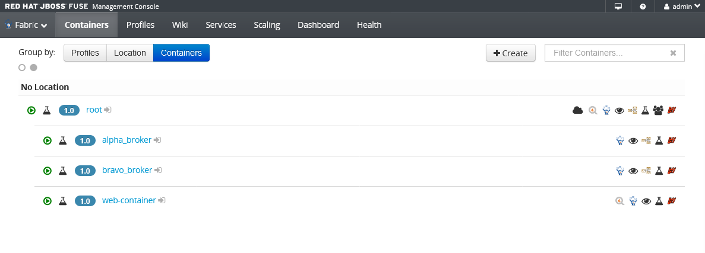
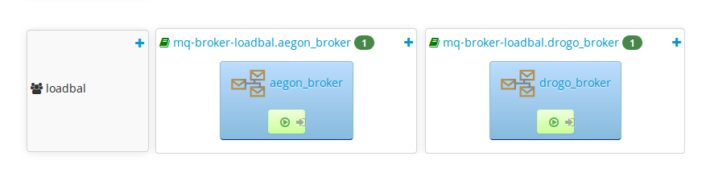

# Broker Topology

This project is a little Camel Route with a CXFRS Endpoint that receives
a GET invocation.  It creates a Java Object, stores it in the Exchange properties
and then invokes an ActiveMQ Queue.  


## Environment Setup
This a reduced version of a Development environment, it uses a Fabric Setup
with three containers as shown below:



with a Front Container with a profile in which the routes of this project 
are deployed.   

There are Two more containers which are two different brokers in the same
broker group `loadbal`.  These are StandAlone brokers, not in MasterSlave
configuration, because the requirement is to have load-balancing:

  

## The Route

The Route is pretty simple, it receives a message from a GET request, then
invokes another route listening on a ActiveMQ Endpoint:

```java
onException(Exception.class)
	.routeId("service.exception.handler")
	.handled(true)
	.log("There is an Error on the Routes: ${exception.message}")
	.process(exchange -> {
			Exception ex = exchange.getProperty(Exchange.EXCEPTION_CAUGHT, Exception.class);
			ServiceResponse resp = exchange.getProperty("serviceResponse", ServiceResponse.class);
			resp.setAmqMessage("NO MESSAGE FROM AMQ!!! WE GOT AN ERROR " + (ex!=null ? ex.getMessage() : "") );
			exchange.getIn().setBody(resp);
	});


from("activemq:service.request")
	.routeId("service.request.activemq")
	.log("ACTIVEMQ Received request")
	.setBody(constant("HELLO FROM ACTIVEMQ"))
	.log("ACTIVEMQ Message response: ${body}");

	
from("cxfrs:bean:cxfRsServer")
	.routeId("service.cxf")
	.process(exchange -> {
		ServiceResponse resp = new ServiceResponse();
		resp.setCxfMessage("HELLO FROM CXF!");
		exchange.setProperty("serviceResponse", resp);
	})
	.inOut("activemq:service.request?replyTo=service.response&replyToType=Shared")
	.log("Response from ActiveMQ: ${body}")
	.process(exchange -> {
			String body = exchange.getIn().getBody(String.class);
			ServiceResponse resp = exchange.getProperty("serviceResponse", ServiceResponse.class);
			resp.setAmqMessage(body);
			exchange.getIn().setBody(resp);
		
	})
	;
		
```


## How to Run
First compile and install the project:

```
> mvn clean install
```

Then setup the Fabric.  I am using  *jboss-fuse-6.3.0.redhat-329* with the 
default admin/admin user uncommented from the `etc/users.properties` file

```
> cd /FUSE_INSTALL/bin
> ./fuse
```

Included with this project, there's a Fabric script in the *etc* folder, which
sets up the Fabric Environment on a fresh Fuse Install.  On another console
I run:


```
> cd /FUSE_INSTALL/bin
> ./client -h localhost -f setup-fabric-environment.fabric
```

Then wait for the Finalization message to appear:

```
Done! If you see this, everything went OK :)
```

Then I execute: 

```
curl -X GET -i http://localhost:8184/cxf/support/main/service
```

Sometimes the response is OK:

```
{"amqMessage":"HELLO FROM ACTIVEMQ","cxfMessage":"HELLO FROM CXF!"}
```
And then sometimes the response does not come with the correct amqMessage:

```
{"amqMessage":"NO MESSAGE FROM AMQ!!! WE GOT AN ERROR The OUT message was not received within: 20000 millis due reply message with correlationID: Camel-ID-jet-45695-1527187921918-1-11 not received on destination: queue://service.response. Exchange[ID-jet-45695-1527187921918-1-10]","cxfMessage":"HELLO FROM CXF!"}
```


## Update

The problem comes from the brokers not being in sync with the default configuration.  To fix this, we must add the following properties to each of the 
broker profiles in the configuration:
```
io.fabric8.mq.fabric.server-"$brokerNode"_broker/network=loadbal
io.fabric8.mq.fabric.server-"$brokerNode"_broker/network.userName="$jmxUser"
io.fabric8.mq.fabric.server-"$brokerNode"_broker/network.password="$jmxPass"
```

Where `$brokerNode` is the name of each of the broker nodes that are part of the mesh configuration.
`$jmxUser` and `$jmxPass` are the configured user and password properties of a valid realm configured for the fabric


## Credits

*Wilbert Guardado* - engellt 

